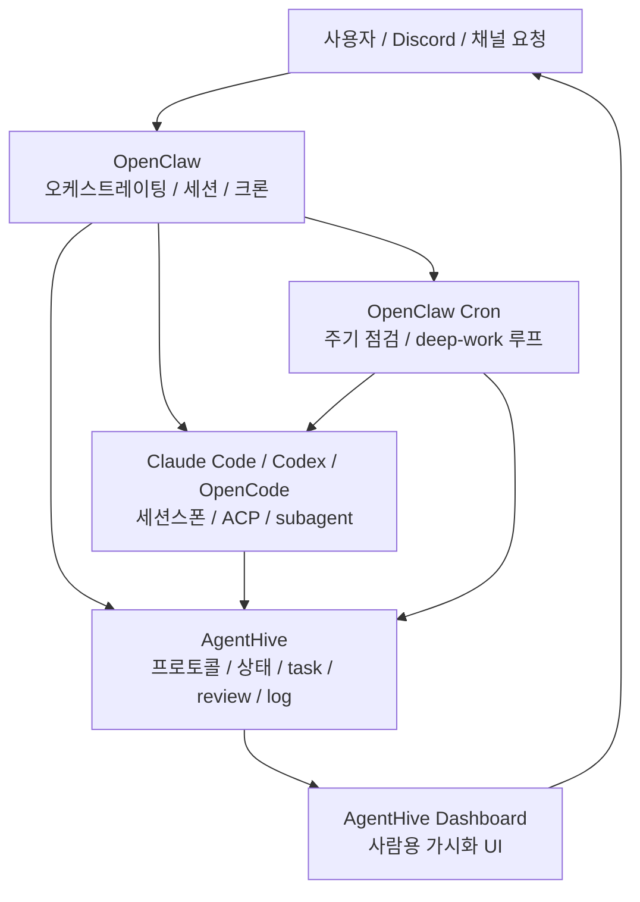
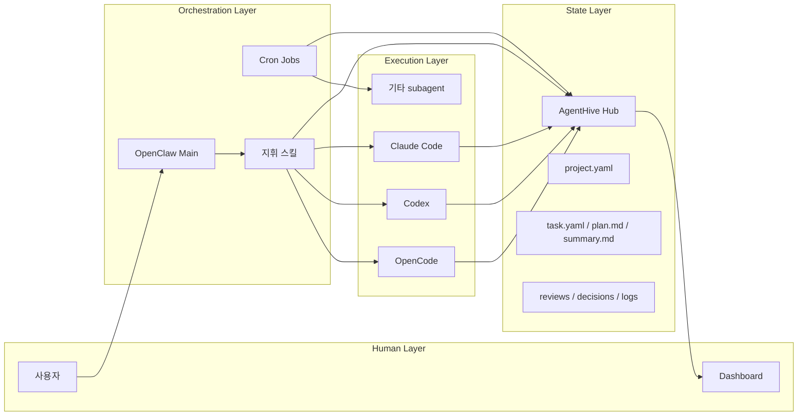
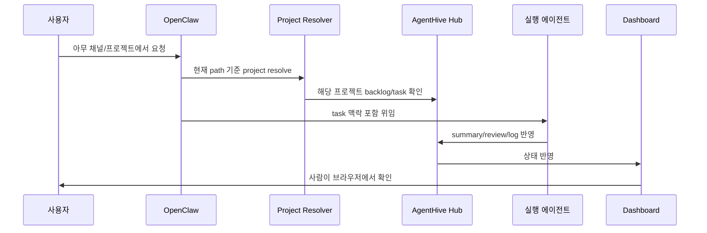
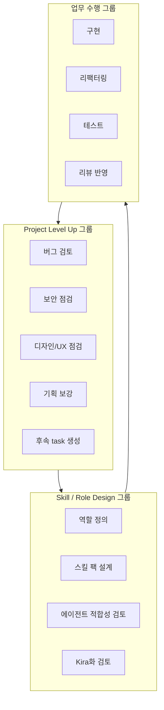
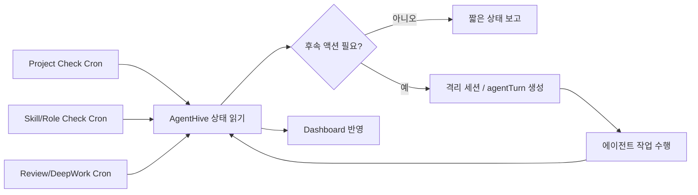

# AgentHive 다이어그램 v1

작성일: 2026-03-11
상태: 설명용 다이어그램 초안

## 1. 전체 구조

## 2. 역할 분리

## 3. 프로젝트 단위 흐름

## 4. Work Group 구조

## 5. 크론 / Deep Work 루프

## 6. 현재 해석

- OpenClaw는 **지휘자**다.
- AgentHive는 **기억/상태 저장소**다.
- Dashboard는 **사람의 관측 창**이다.
- 에이전트는 Dashboard가 아니라 AgentHive 파일을 보고 일한다.
