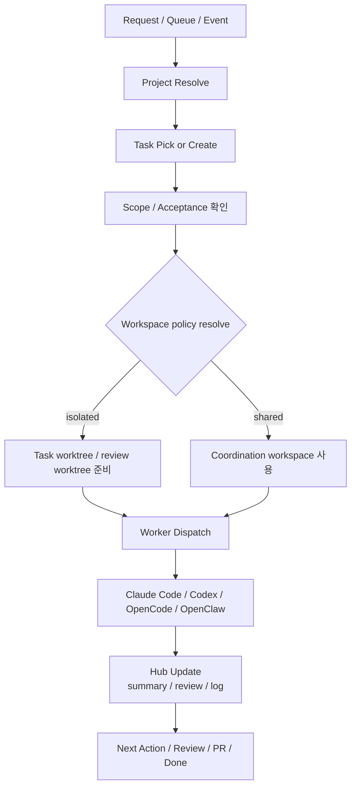

# AgentHive Dispatch Model v1

작성일: 2026-03-11
상태: 설계 초안

## 1. 핵심 원칙

AgentHive는 업무의 **공통 실행 코어**다.
Track A(오케스트레이터 개입)와 Track B(하이브 자체 큐/크론/이벤트)는 진입점만 다르고, 실제 작업 진행 코어는 같다.

- Track A: 사용자/오케스트레이터가 먼저 요청을 집는다.
- Track B: AgentHive queue/cron/event가 먼저 요청을 집는다.

## 2. Symphony에서 차용할 점

OpenAI Symphony류 운영에서 가져오면 좋은 포인트는 다음과 같다.

### A. 충돌 방지용 격리 작업공간
- 병렬 작업이 충돌할 수 있으면 worktree 또는 별도 workspace를 만든다.
- 동일 repo에 여러 에이전트가 붙을 때는 task 단위 workspace 분리를 기본값으로 둔다.
- review용/실험용/구현용 workspace를 구분할 수 있다.
- 상세 기준은 `docs/agenthive-workspace-worktree-policy-v1.md`를 따른다.

### B. 저장소 부트스트랩
- `.git`이 없다면 project bootstrap 단계에서 초기화 여부를 점검한다.
- git이 없는 프로젝트는 VCS 미설정 상태로 표시하고, 필요 시 초기화 task를 만든다.

### C. 역할 분산
- planner / builder / reviewer / researcher / designer 역할을 분리한다.
- 동일 task라도 역할별로 다른 assistant/agent가 붙을 수 있다.

### D. 이벤트 기반 후속 실행
- 이슈 생성
- 카드 생성
- 작업 분기
- 리뷰 요청
- PR 생성
같은 후속 흐름을 event-driven으로 연결한다.

## 3. 기본 dispatch 흐름

운영 규칙:

- planner/researcher의 경량 조사나 docs-only 작업만 shared workspace에 남는다.
- builder/reviewer의 mutable 작업은 기본적으로 isolated worktree에서 실행한다.
- Track A와 Track B는 같은 policy를 사용하므로, 진입점이 달라도 workspace 결정 규칙은 동일하다.

## 4. 상태 다이어그램 운영

내부적으로는 상태 다이어그램을 함께 표시하는 것이 좋다.

### Project 상태
- discovered
- registered
- active
- deepwork
- review-heavy
- blocked
- dormant
- archived

### Task 상태
- backlog
- ready
- doing
- review
- done
- blocked
- stale

### Dispatch 상태
- queued
- claimed
- workspace-prepared
- running
- waiting-review
- waiting-human
- retry
- completed
- failed

## 5. Git / GitHub 오토파일럿 모드

조건:
- git 저장소가 설정되어 있음
- GitHub repo가 연결되어 있음
- 이슈 오토파일럿이 활성화되어 있음

그러면 아래 흐름이 가능하다.

### Event flow
1. GitHub issue 생성 이벤트 감지
2. 후보 필터링 + 중복 카드 확인
3. AgentHive 카드/task 생성 또는 갱신
4. task scope / acceptance / autopilot level 분석
5. workspace policy 평가 + worktree/workspace 준비
6. builder agent에게 구현 위임
7. reviewer agent에게 review gate 위임
8. 결과 통합 후 PR 패키지 또는 draft PR 준비
9. AgentHive hub와 Dashboard에 상태 반영

핵심 규칙:

- 카드 생성과 상태 동기화는 coordination workspace에서 처리한다.
- 실제 mutable build는 task worktree에서만 수행한다.
- reviewer는 builder workspace를 재사용하지 않고 review worktree에서 검증한다.
- review gate를 통과하기 전에는 PR 단계로 진입하지 않는다.

상세 규칙은 `docs/agenthive-github-issue-autopilot-rule-v1.md`를 따른다.

## 6. 오토파일럿 모드 단계

### Level 1
- 이슈 감지
- 카드 생성
- 사람에게 제안만

### Level 2
- 카드 생성
- worktree 생성
- 구현 agent 위임
- 리뷰 요청까지 자동
- PR 생성은 제안

### Level 3
- 카드 생성
- 구현/리뷰/정리 자동
- 조건 충족 시 PR 생성까지 수행

권장: Level 1 → Level 2 → Level 3 순으로 점진 활성화

## 7. worker assignment 원칙

- planner: 요구 분석, task 분해, acceptance 정의
- builder: 구현, 테스트, 산출물 작성
- reviewer: diff 검토, 위험 점검, 승인/반려
- researcher: 근거 수집, 비교 분석
- designer: UX/IA/화면 흐름 설계

## 8. 다음 구현 과제

- queue / cron / event rule 스키마 초안
- worktree/workspace policy를 dispatch runtime에 연결
- GitHub issue autopilot rule을 runtime rule과 dashboard state에 연결
- 상태 다이어그램을 dashboard에 시각화하는 방안 검토
