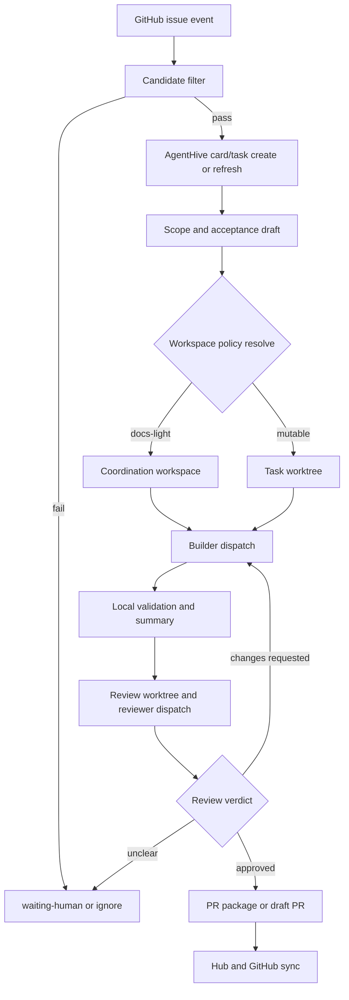

# AgentHive GitHub Issue Autopilot Rule v1

작성일: 2026-03-11
상태: 운영 규칙 초안

## 1. 목적

GitHub issue 이벤트를 AgentHive 내부 카드/task 생성, workspace/worktree 준비, build, review, PR 흐름으로 연결하는 기본 오토파일럿 규칙을 정의한다.

이 문서는 Track B 기본 루프에서 issue event를 처리할 때의 표준 규칙이며, Track A에서 사람이 issue 링크를 넘겨 수동 개입하더라도 같은 규칙을 재사용한다.

## 2. 활성화 전제

아래 조건이 모두 만족될 때만 issue autopilot이 동작한다.

- 대상 project가 git 저장소다.
- project가 GitHub remote와 연결되어 있다.
- project 설정에서 `autopilot.github_issue.enabled=true`다.
- autopilot level이 `1`, `2`, `3` 중 하나로 지정되어 있다.

추가 보호 규칙:

- `require_label`이 설정된 경우 지정 라벨이 없는 issue는 카드 후보로만 기록하고 자동 실행하지 않는다.
- 이미 열린 PR이 연결된 issue는 새 builder task를 만들지 않고 기존 PR/Task와만 동기화한다.
- 닫힌 issue, 질문형 issue, 장기 epic은 기본적으로 자동 build 대상에서 제외한다.

## 3. 이벤트 진입 규칙

자동 intake 대상 이벤트는 아래로 제한한다.

| GitHub 이벤트 | 기본 동작 |
|---|---|
| `issues.opened` | 새 카드 후보 생성 |
| `issues.reopened` | 기존 카드 재활성화 또는 새 카드 생성 |
| `issues.labeled` | autopilot 라벨이 붙으면 재평가 |
| `issues.edited` | 제목/본문/acceptance 변경 시 카드 메타데이터 갱신 |
| `issues.closed` | 연결 task가 미착수면 종료, 진행 중이면 사람 확인 대기 |

무시 규칙:

- 같은 issue 번호에 `backlog`, `ready`, `doing`, `review` 상태 task가 이미 있으면 중복 카드 생성 금지
- issue body가 비어 있고 scope를 추정할 수 없으면 `waiting-human`으로 보류
- 다른 active task와 scope 충돌이 큰 경우 즉시 build하지 않고 queue에 남긴다

## 4. 카드 생성 규칙

issue가 intake를 통과하면 AgentHive는 아래 순서로 카드를 만든다.

1. `project resolve`로 해당 repo와 hub project를 찾는다.
2. 같은 issue 번호를 가진 active task가 있는지 확인한다.
3. 없으면 새 `TASK-NNN`을 만든다.
4. task title은 `[#<issue-number>] <issue-title>` 형식으로 정규화한다.
5. task 메타데이터에 GitHub 원본을 남긴다.

카드에 남겨야 하는 최소 메타데이터:

- `external_ref.github.issue_number`
- `external_ref.github.issue_url`
- `external_ref.github.repo`
- `autopilot.level`
- `autopilot.source_event`
- `autopilot.last_synced_at`

카드 생성 직후 상태 규칙:

- intake만 끝난 상태는 `backlog`
- acceptance와 scope가 추론 가능하면 `ready`
- builder를 바로 붙일 수 있을 만큼 scope가 명확하고 충돌이 없으면 `doing`

## 5. 계획과 scope 정리 규칙

builder dispatch 전에는 항상 경량 plan 단계가 선행된다.

필수 산출물:

- 수정 범위 추정
- acceptance 초안
- 위험도 분류
- workspace 모드 판정
- reviewer 필요 수

분류 기준:

- `docs-only`: 문서/메타데이터만 수정
- `local-code`: 코드/테스트/스크립트 수정, 외부 배포 없음
- `integration-risk`: 설정, 생성물, 릴리즈, 다중 패키지 영향

scope가 불명확하면 Level과 무관하게 `ready` 또는 `waiting-human`에서 멈춘다.

## 6. workspace / worktree 준비 규칙

workspace 준비는 `docs/agenthive-workspace-worktree-policy-v1.md`를 따른다. issue autopilot의 기본값은 아래와 같다.

| 단계 | 기본 작업공간 |
|---|---|
| issue intake / 카드 생성 / plan 생성 | coordination workspace |
| builder 구현 | task worktree |
| reviewer 검증 | review worktree |
| PR body 정리 / 상태 동기화 | coordination workspace 또는 clean metadata workspace |

강제 규칙:

- builder는 issue 기반 autopilot이라도 shared workspace에서 mutable 작업을 하지 않는다.
- reviewer는 builder worktree를 재사용하지 않는다.
- docs-only task라도 branch 생성이나 동시 작업 가능성이 있으면 task worktree로 승격한다.
- queue picker가 애매하면 `shared`가 아니라 `isolated`를 선택한다.

기본 경로:

- builder: `~/.agenthive/worktrees/{project-slug}/{task-id}-builder-{agent-id}`
- reviewer: `~/.agenthive/worktrees/{project-slug}/{task-id}-reviewer-{agent-id}`

## 7. build dispatch 규칙

build 단계는 아래 조건을 만족할 때만 자동 시작한다.

- task status가 `ready` 또는 `doing`
- scope와 acceptance가 최소 수준으로 채워짐
- workspace가 준비됨
- 충돌하는 active task가 없음
- autopilot level이 build 허용 수준임

build dispatch 후 표준 흐름:

1. builder claim
2. branch 생성: `agent/{agent-id}/{task-id}`
3. 구현 및 로컬 검증
4. `summary` 갱신
5. review handoff 생성
6. task status를 `review`로 이동

## 8. review gate 규칙

모든 변경형 issue task는 PR 전 review gate를 통과해야 한다.

| 작업 분류 | 기본 gate |
|---|---|
| docs-only | reviewer 1명 또는 human reviewer 1회 |
| local-code | reviewer 1명 + 관련 로컬 검증 통과 |
| integration-risk | reviewer 1명 + human confirmation + 필요한 추가 검증 |

반려 규칙:

- acceptance 불충족
- 테스트/검증 실패
- scope 밖 수정
- 정리되지 않은 충돌 또는 미추적 변경

review 결과:

- 승인: `review -> pr-ready`
- 수정 필요: `review -> doing`
- 판단 불가: `review -> waiting-human`

## 9. PR 흐름 규칙

PR 단계는 review 이후에만 열린다.

PR 준비 조건:

- builder branch가 존재한다
- summary와 review 기록이 갱신되었다
- 최소 gate가 승인되었다
- issue 번호와 task id가 PR 제목/본문에 연결된다

기본 PR 제목 형식:

`[{task-id}] {issue-title}`

기본 PR 본문 요소:

- closes 또는 relates GitHub issue 번호
- task acceptance checklist
- 로컬 검증 결과
- reviewer verdict 요약

autopilot level별 PR 동작:

| Level | PR 동작 |
|---|---|
| 1 | PR 없음, card와 plan만 생성 |
| 2 | review 통과 후 draft PR 초안만 준비하고 사람 확인 대기 |
| 3 | review 통과 후 draft PR 생성, 필요 시 ready-for-review까지 자동 진행 |

자동 merge는 이 규칙 범위 밖이다. merge는 별도 higher-trust rule에서만 허용한다.

## 10. 상태 동기화 규칙

issue autopilot은 hub, GitHub, dashboard 상태를 느슨하게 동기화한다.

권장 매핑:

| AgentHive 상태 | GitHub 표시 |
|---|---|
| `backlog` / `ready` | `agenthive:queued` 라벨 또는 코멘트 |
| `doing` | `agenthive:doing` |
| `review` | `agenthive:review` |
| `pr-ready` / draft PR 생성됨 | `agenthive:pr` |
| `blocked` / `waiting-human` | `agenthive:blocked` |
| `done` | issue 코멘트 또는 linked PR 상태로 종료 |

동기화 원칙:

- GitHub는 외부 인터페이스, hub는 운영 진실원본으로 본다.
- label/comment 동기화 실패가 task 실행 자체를 막지는 않는다.
- 하지만 issue 번호와 task id 매핑 실패는 build dispatch를 막는다.

## 11. 표준 End-to-End 흐름

## 12. 연관 문서

- [docs/agenthive-dispatch-model-v1.md](./agenthive-dispatch-model-v1.md)
- [docs/agenthive-state-diagram-v1.md](./agenthive-state-diagram-v1.md)
- [docs/agenthive-review-gate-v1.md](./agenthive-review-gate-v1.md)
- [docs/agenthive-two-track-operation-v1.md](./agenthive-two-track-operation-v1.md)
- [docs/agenthive-workspace-worktree-policy-v1.md](./agenthive-workspace-worktree-policy-v1.md)
