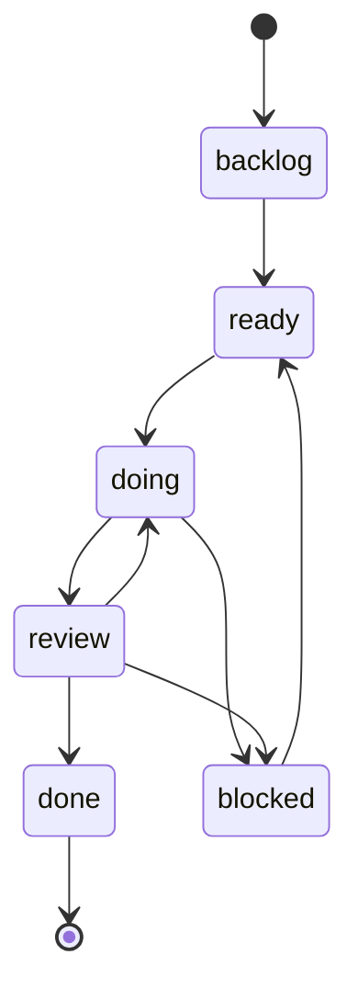

# AgentHive Review Gate v1

작성일: 2026-03-11
상태: 운영 보강 초안

## 1. 목적

현재 로컬 git 기반 작업은 반영 속도가 빠르다.
하지만 중간에 review 단계가 없으면 잘못된 변경도 너무 빨리 누적될 수 있다.
따라서 AgentHive 기본 운영에 review gate를 명시적으로 둔다.

## 2. 기본 원칙

- 빠른 반영보다 review 가능성이 우선이다.
- Track A/B 어느 경로로 들어온 작업이든 review gate를 지난다.
- 단순 상태 점검과 실제 변경 작업을 구분한다.

## 3. 최소 흐름

### 점검형 작업
- backlog/ready/doing/review 상태 점검
- 후속 task 제안
- summary/log 갱신
- 코드 변경 없음

이 경우 review는 선택적이다.

### 변경형 작업
- 코드 수정
- 설정 수정
- 생성 파일 반영
- 자동화 로직 변경

이 경우 최소 review 1회를 기본값으로 둔다.

## 4. 권장 상태 흐름

## 5. review gate 규칙

- worker가 변경을 완료하면 바로 done으로 가지 않고 review로 이동
- reviewer는 diff / 위험 / acceptance 충족 여부를 본다
- 문제가 있으면 doing으로 되돌려 수정
- 충분하면 done으로 승인

## 6. 오토파일럿과의 관계

GitHub issue autopilot에서도 review gate는 중요하다.

- build dispatch 후 review dispatch를 별도 단계로 둔다
- PR 생성 전 최소 review gate를 거친다
- 자동 병합은 더 높은 autopilot 단계에서만 허용한다

기본 판단 규칙:

- docs-only 이슈는 reviewer 1명 또는 human reviewer 1회가 최소 gate다.
- code/test/script 변경 이슈는 reviewer 1명과 로컬 검증 통과가 최소 gate다.
- 설정/생성물/다중 패키지 영향 이슈는 reviewer 외에 human confirmation을 추가한다.

PR 진입 전 필수 조건:

- summary가 최신 상태다
- review verdict가 승인이다
- builder branch와 issue/task 연결 정보가 정리되었다

상세 단계는 `docs/agenthive-github-issue-autopilot-rule-v1.md`를 따른다.

## 7. 운영 메모

- Dashboard 내부 ops panel에서 review 병목을 별도 표시하면 좋다.
- review 대기 시간이 길어지면 Project Level Up 또는 Review Queue 점검 루프가 개입하게 한다.
