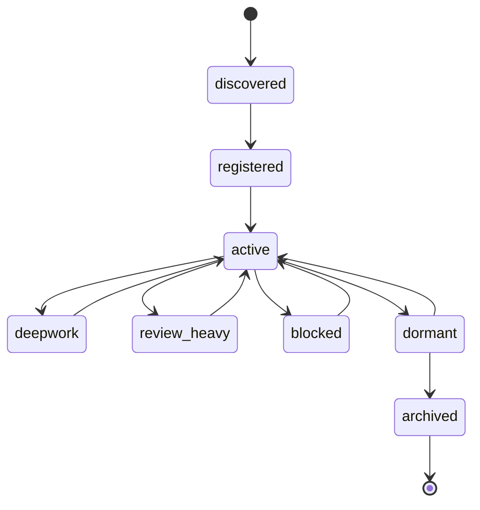
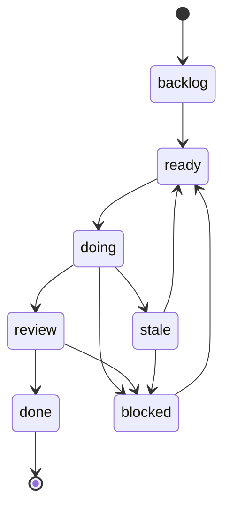
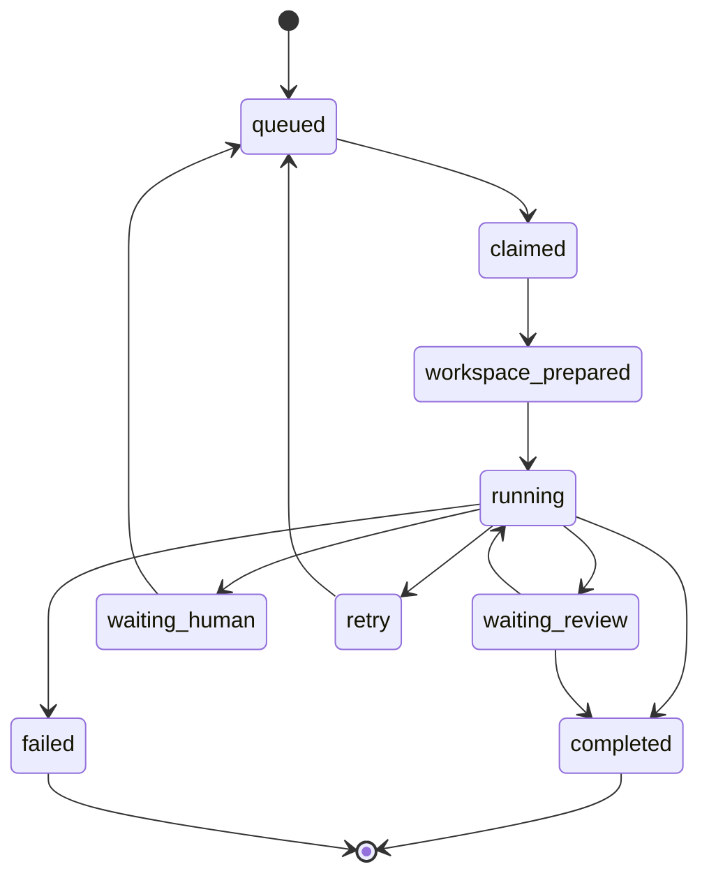
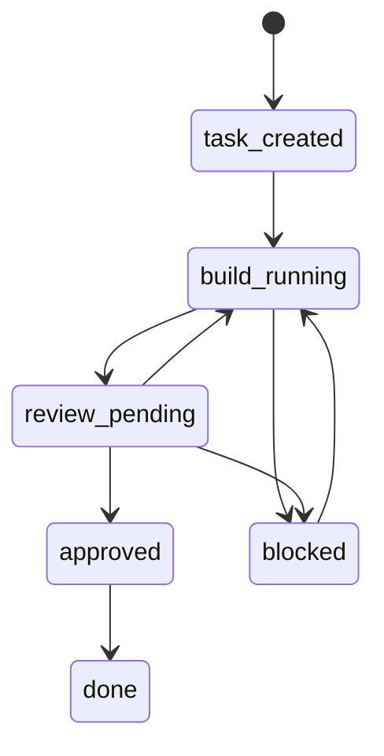
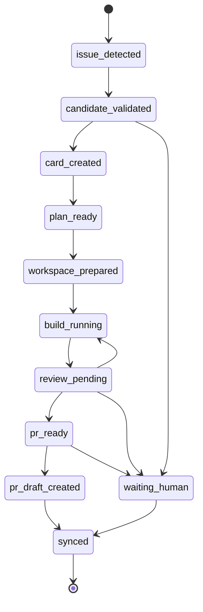

# AgentHive State Diagram v1

작성일: 2026-03-11
상태: 운영 시각화 초안

## 1. Project 상태 다이어그램

## 2. Task 상태 다이어그램

## 3. Dispatch 상태 다이어그램

## 3-1. 변경형 작업 Review Gate

## 4. GitHub Issue Autopilot 상태 다이어그램

## 5. 운영 메모

- 이 상태도들은 Dashboard에 내부 운영 패널로 표시하면 좋다.
- Project / Task / Dispatch를 따로 보여주면 운영자가 병목을 더 쉽게 본다.
- 오토파일럿 레벨이 올라갈수록 Dispatch 상태 추적이 더 중요해진다.
- `workspace_prepared` 진입 기준은 `docs/agenthive-workspace-worktree-policy-v1.md`에서 정의한다.
- issue autopilot의 candidate filter, review gate, PR 진입 기준은 `docs/agenthive-github-issue-autopilot-rule-v1.md`에서 구체화한다.
